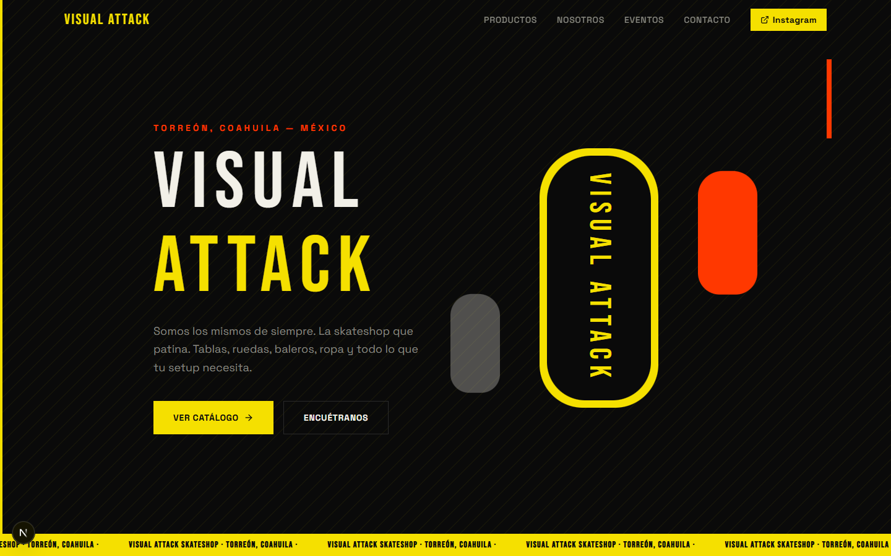
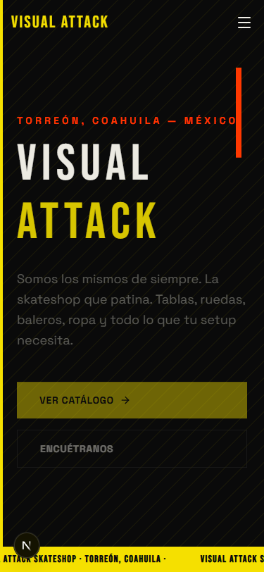

# Visual Attack SkateShop

Landing page oficial de **Visual Attack SkateShop**, la skateshop de Torreón, Coahuila, México. Construida con Next.js 16, Tailwind CSS v4 y shadcn/ui.



---

## Stack

| Tecnología | Versión |
|------------|---------|
| Next.js | 16.2 |
| React | 19 |
| TypeScript | 5 |
| Tailwind CSS | 4 |
| shadcn/ui | 4 |
| Framer Motion | 12 |
| Lucide React | latest |

---

## Estructura del proyecto

```
src/
├── app/
│   ├── layout.tsx       # Fuentes, metadata y OG tags
│   ├── page.tsx         # Página principal (ensamblado de secciones)
│   └── globals.css      # Estilos globales y variables CSS
└── components/
    ├── Navbar.tsx
    ├── HeroSection.tsx
    ├── ProductosSection.tsx
    ├── NosotrosSection.tsx
    ├── EventosSection.tsx
    ├── ContactoSection.tsx
    └── Footer.tsx
```

---

## Secciones de la página

- **Hero** — Llamada principal con CTA a Instagram
- **Productos** — Catálogo de categorías: tablas, ruedas, baleros, lijas y ropa
- **Nosotros** — Historia y valores de la tienda
- **Eventos** — Skate jams, concursos y actividades en Torreón
- **Contacto** — Dirección, horarios y redes sociales
- **Footer** — Links y créditos

---

## Instalación local

**Requisitos:** Node.js 18 o superior.

```bash
# 1. Clonar el repositorio
git clone https://github.com/<tu-usuario>/visual-attack-skateshop.git
cd visual-attack-skateshop

# 2. Instalar dependencias
npm install

# 3. Iniciar el servidor de desarrollo
npm run dev
```

Abre [http://localhost:3000](http://localhost:3000) en tu navegador.

---

## Scripts disponibles

```bash
npm run dev      # Servidor de desarrollo con hot-reload
npm run build    # Build de producción
npm run start    # Servidor de producción (requiere build previo)
```

---

## Fuentes

Las fuentes se cargan vía `next/font/google` (sin CDN externo):

- **Bebas Neue** — Títulos y headings
- **Space Grotesk** — Cuerpo de texto y UI

---

## Capturas de pantalla

| Desktop | Mobile |
|---------|--------|
|  |  |

---

## SEO

- Meta title y description configurados en `layout.tsx`
- Open Graph tags para redes sociales
- `lang="es"` y `locale: "es_MX"` declarados
- Jerarquía de headings correcta (`h1` → `h2` → `h3`)

---

## Licencia

MIT — libre para usar, modificar y distribuir.

---

Built with [Claude Web Builder](https://tododeia.com) by [Tododeia](https://tododeia.com)
